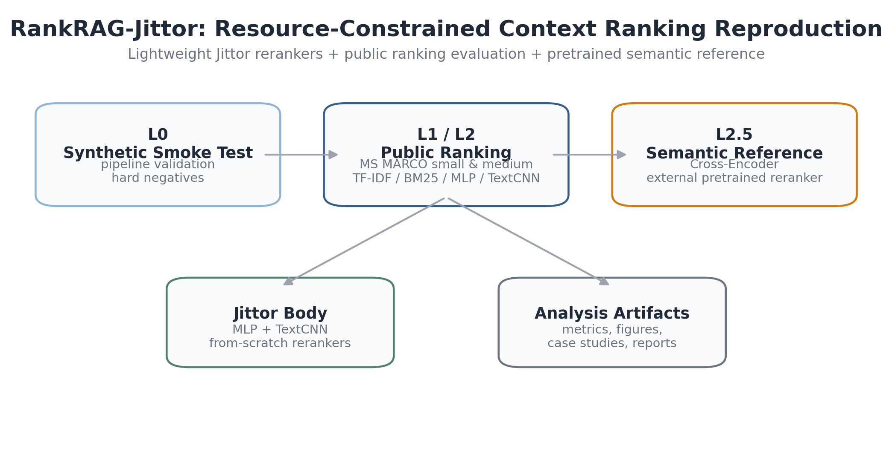
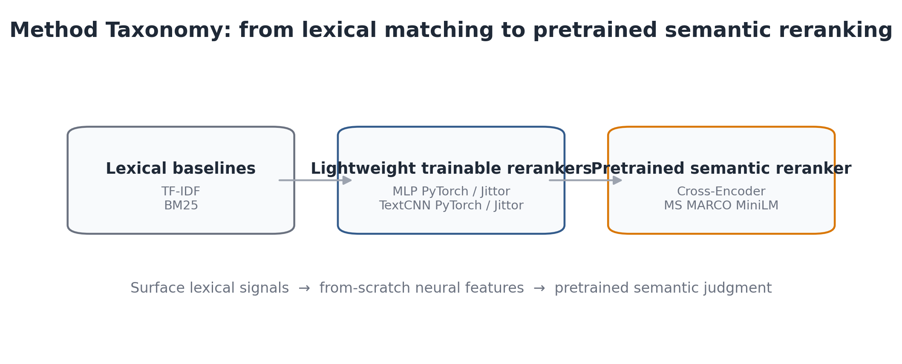
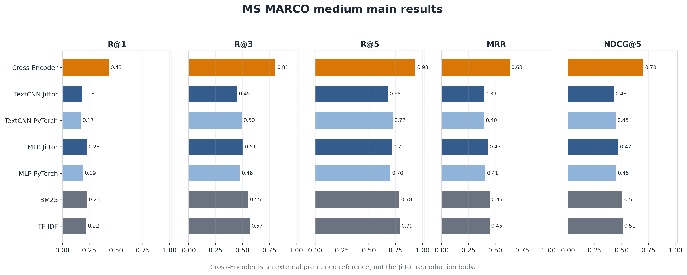
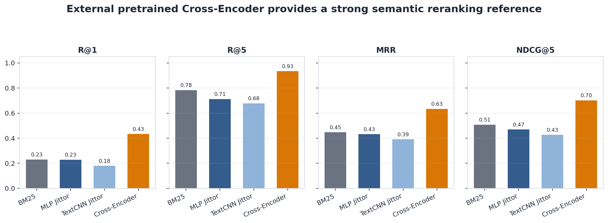
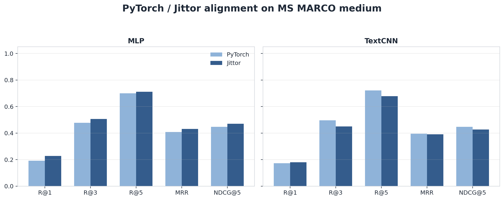
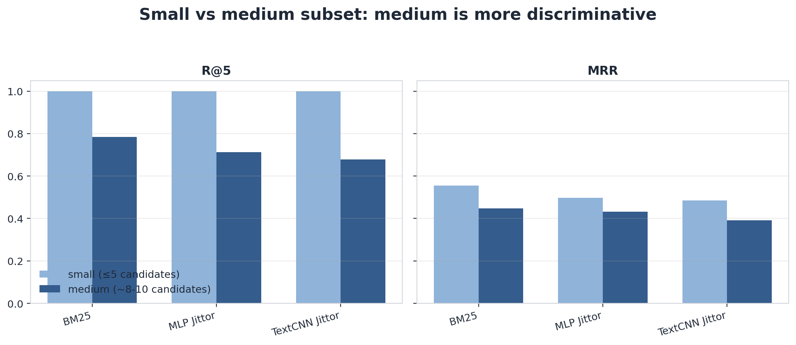
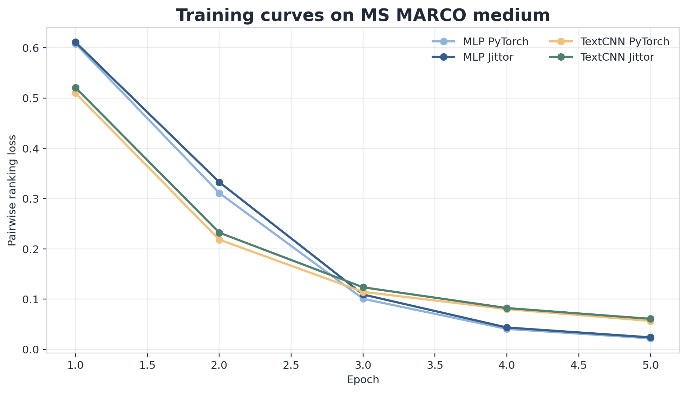
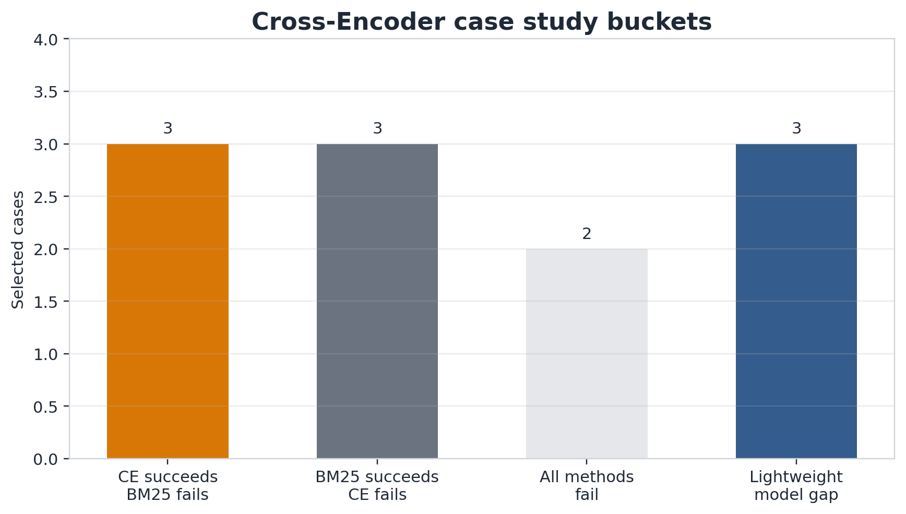

# RankRAG-Jittor: Lightweight Context Ranking Reproduction

RankRAG-Jittor is a resource-constrained reproduction and analysis project for RankRAG-style context ranking. It includes Jittor-based lightweight rerankers, public-data evaluation on MS MARCO small/medium subsets, and an external pretrained semantic reranker reference for analyzing why LLM-style reranking matters.



## Highlights

- Jittor reproduction of lightweight context rerankers for evidence filtering.
- MS MARCO small and medium public-data evaluation.
- PyTorch / Jittor alignment for MLP and TextCNN rerankers.
- Lexical, neural, and pretrained semantic reranker comparison.
- External Cross-Encoder reference to analyze RankRAG-style reranking motivation.
- Case studies, error analysis, hardware notes, and reproducible figure scripts.

## Repository Structure

```text
RankRAG-Jittor/
├── configs/                  # synthetic, MS MARCO, medium, and TextCNN configs
├── data/processed/           # synthetic and MS MARCO small/medium subsets
├── docs/                     # method notes, result analysis, case studies
│   └── figures/              # polished README figures
├── outputs/                  # metrics, rankings, aggregate tables, figures
├── scripts/                  # data prep, experiment launchers, README figure generation
└── src/                      # models, training/eval, aggregation, case study scripts
```

## Method Taxonomy and Experiment Levels



| Level | Purpose | Methods |
| --- | --- | --- |
| L0 | Pipeline smoke test | synthetic hard-negative benchmark |
| L1 | Lightweight reranker alignment | MLP PyTorch / Jittor |
| L2 | Public-data multi-model comparison | TF-IDF, BM25, MLP, TextCNN |
| L2.5 | Semantic reranking analysis | external pretrained Cross-Encoder reference |

The Jittor reproduction body is the lightweight MLP/TextCNN reranking pipeline. The Cross-Encoder is an external pretrained reference, not a Jittor model and not a replacement for the reproduction body.

## Main Results



| Method | Training | R@1 | R@3 | R@5 | MRR | NDCG@5 |
| --- | --- | ---: | ---: | ---: | ---: | ---: |
| TF-IDF | none | 0.2220 | 0.5700 | 0.7880 | 0.4465 | 0.5084 |
| BM25 | none | 0.2300 | 0.5540 | 0.7840 | 0.4476 | 0.5074 |
| MLP Jittor | from scratch | 0.2280 | 0.5060 | 0.7120 | 0.4318 | 0.4698 |
| TextCNN Jittor | from scratch | 0.1800 | 0.4500 | 0.6780 | 0.3912 | 0.4270 |
| Cross-Encoder | external pretrained | 0.4340 | 0.8080 | 0.9340 | 0.6341 | 0.7019 |

On the MS MARCO medium subset, the external pretrained Cross-Encoder significantly outperforms both lexical baselines and from-scratch lightweight rerankers. This highlights the importance of pretrained semantic reranking and explains the motivation behind RankRAG-style LLM reranking.



## Key Findings

1. BM25 is a strong lexical baseline on MS MARCO, especially when query-passage word overlap is reliable.
2. From-scratch lightweight rerankers are useful for validating a Jittor ranking pipeline, but their semantic capacity is limited.
3. PyTorch and Jittor implementations remain reasonably aligned for both MLP and TextCNN.
4. Pretrained semantic reranking substantially improves retrieval quality, which motivates RankRAG-style LLM reranking.



## Why Medium Matters

The small subset is useful for quick verification, but its candidate set is too small for Recall@5 to be very discriminative. The medium subset uses 500 test queries and up to 10 candidates per query, making R@5 and NDCG@5 more meaningful.



## Training Curves



The lightweight rerankers train normally under the pairwise ranking objective. These curves are included to show training behavior, not to claim full RankRAG performance.

## Case Study Summary



Qualitative cases compare BM25, MLP Jittor, TextCNN Jittor, and Cross-Encoder on the same MS MARCO medium candidate sets. They show why lexical matching can be strong, where lightweight models struggle, and how pretrained semantic reranking changes the ranking behavior.

## Reproduction Scope and Boundary

This project does **not** fully reproduce the complete Llama3-RankRAG training pipeline. It does not perform LLM instruction tuning and does not implement answer generation.

Instead, it focuses on:

- a resource-constrained reproduction of the context ranking / selector component;
- Jittor and PyTorch alignment for lightweight rerankers;
- MS MARCO small/medium public-data evaluation;
- a supplementary pretrained Cross-Encoder reference for semantic reranking analysis.

The Cross-Encoder experiment is an external pretrained semantic reranker reference. It should not be described as a Jittor implementation or as a model trained by this repository.

## Quick Start

Install dependencies:

```bash
conda create -p .venv-jittor python=3.10 -y
conda activate ./.venv-jittor
pip install -r requirements.txt
```

Synthetic smoke test:

```bash
python scripts/prepare_data.py
bash scripts/run_train_torch.sh
bash scripts/run_eval_torch.sh
bash scripts/run_train_jittor.sh
bash scripts/run_eval_jittor.sh
python src/compare_results.py
python src/plot_results.py
```

MS MARCO medium L2 experiments:

```bash
python scripts/prepare_msmarco_subset.py \
  --max_train_queries 5000 \
  --max_valid_queries 500 \
  --max_test_queries 500 \
  --candidates_per_query 10 \
  --output_dir data/processed/msmarco_medium \
  --run_name msmarco_medium \
  --seed 42

bash scripts/run_retrieval_baselines_msmarco_medium.sh
bash scripts/run_train_torch_msmarco_medium.sh
bash scripts/run_eval_torch_msmarco_medium.sh
bash scripts/run_train_jittor_msmarco_medium.sh
bash scripts/run_eval_jittor_msmarco_medium.sh
bash scripts/run_train_textcnn_torch_msmarco_medium.sh
bash scripts/run_eval_textcnn_torch_msmarco_medium.sh
bash scripts/run_train_textcnn_jittor_msmarco_medium.sh
bash scripts/run_eval_textcnn_jittor_msmarco_medium.sh
python src/aggregate_l2_results.py --run_name msmarco_medium
python src/case_study_msmarco.py --run_name msmarco_medium
```

L2.5 external Cross-Encoder reference:

```bash
bash scripts/run_cross_encoder_msmarco_medium.sh
python src/aggregate_l25_results.py
python src/case_study_cross_encoder.py
```

Windows PowerShell:

```powershell
powershell -ExecutionPolicy Bypass -File scripts/run_cross_encoder_msmarco_medium.ps1
python src/aggregate_l25_results.py
python src/case_study_cross_encoder.py
```

Regenerate polished README figures:

```bash
python scripts/make_readme_figures.py
```

Readiness check:

```bash
python scripts/check_project_ready.py
```

## Documents and Reports

| Document | Purpose |
| --- | --- |
| [docs/method_summary.md](docs/method_summary.md) | Method scope and reproduction design |
| [docs/result_analysis.md](docs/result_analysis.md) | Detailed result interpretation |
| [docs/hardware_report.md](docs/hardware_report.md) | Hardware and environment notes |
| [docs/msmarco_case_study.md](docs/msmarco_case_study.md) | Small-subset case study |
| [docs/msmarco_medium_case_study.md](docs/msmarco_medium_case_study.md) | Medium-subset case study |
| [docs/msmarco_medium_cross_encoder_case_study.md](docs/msmarco_medium_cross_encoder_case_study.md) | Cross-Encoder qualitative comparison |

## Main Artifacts

| Artifact | Path |
| --- | --- |
| L2 medium aggregate table | [outputs/l2_msmarco_medium_results.md](outputs/l2_msmarco_medium_results.md) |
| L2.5 aggregate table | [outputs/l25_msmarco_medium_results.md](outputs/l25_msmarco_medium_results.md) |
| Cross-Encoder metrics | [outputs/msmarco_medium_cross_encoder_metrics.json](outputs/msmarco_medium_cross_encoder_metrics.json) |
| Cross-Encoder rankings | [outputs/msmarco_medium_cross_encoder_rankings.json](outputs/msmarco_medium_cross_encoder_rankings.json) |
| README figures | [docs/figures](docs/figures) |

## Citation and Acknowledgement

This project is inspired by:

```text
Yue Yu, Wei Ping, Zihan Liu, Boxin Wang, Jiaxuan You, Chao Zhang,
Mohammad Shoeybi, Bryan Catanzaro. 2024.
RankRAG: Unifying Context Ranking with Retrieval-Augmented Generation in LLMs.
NeurIPS 2024.
```

The MS MARCO subsets are derived from `microsoft/ms_marco`. The Cross-Encoder reference uses `cross-encoder/ms-marco-MiniLM-L6-v2` from the sentence-transformers ecosystem.
