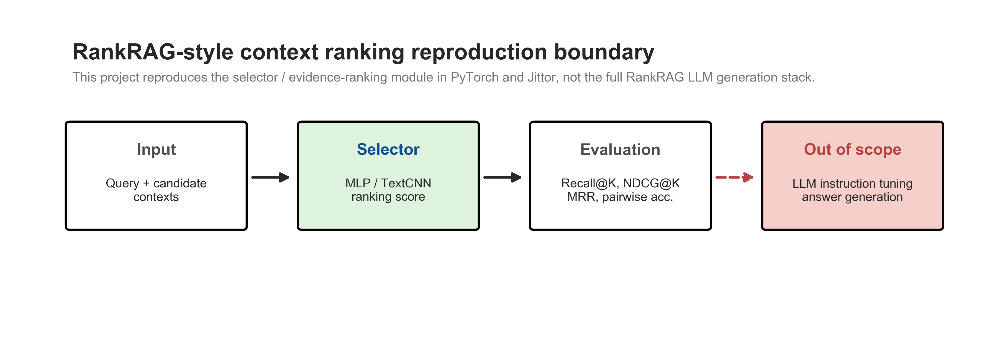
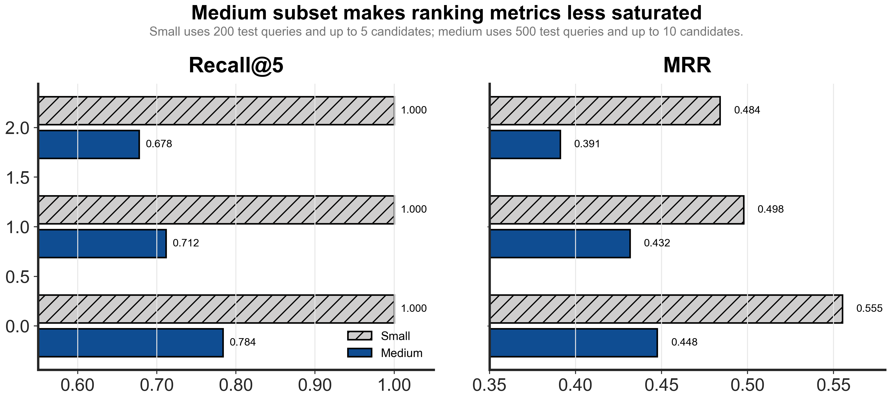
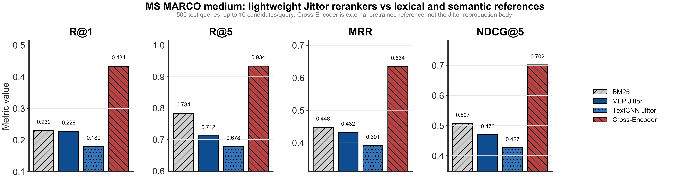
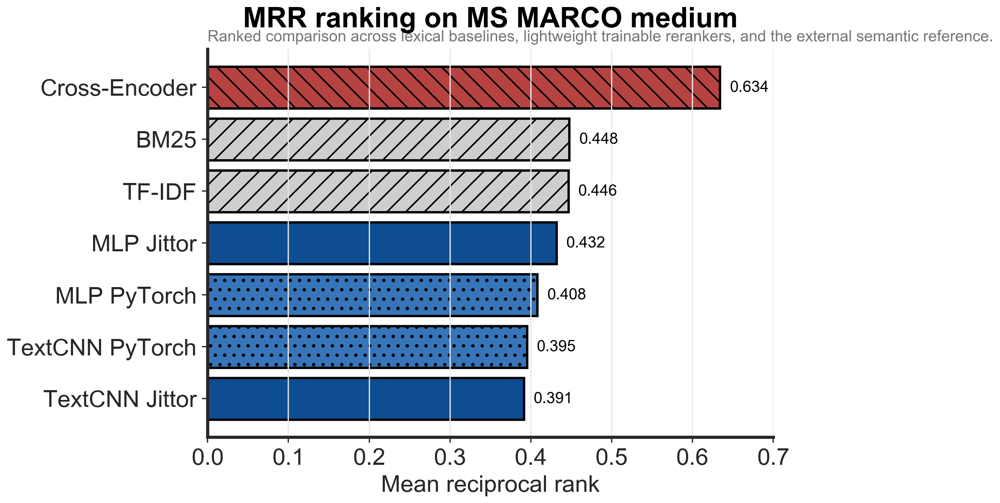

# RankRAG-style Context Ranking in Jittor

This repository is a lightweight reproduction of the **context ranking / evidence selector** idea from RankRAG. It implements compact rerankers in PyTorch and Jittor, evaluates them on synthetic smoke data and MS MARCO subsets, and compares them with lexical baselines plus an external pretrained Cross-Encoder reference.

It does **not** reproduce full RankRAG LLM instruction tuning or answer generation.



## Scope

| Component | Status |
| --- | --- |
| Synthetic hard-negative smoke test | Done |
| MS MARCO small subset | Done |
| MS MARCO medium subset | Done |
| PyTorch MLP reranker | Done |
| Jittor MLP reranker | Done |
| PyTorch/Jittor TextCNN reranker | Done |
| TF-IDF / BM25 baselines | Done |
| External Cross-Encoder reference | Done |
| Full LLM generation | Out of scope |

## Method

The main reproduction target is the ranking module:

```text
query + candidate context
-> feature encoder or token encoder
-> MLP / TextCNN scorer
-> pairwise ranking loss
-> ranked candidate contexts
```

The MLP scorer uses fixed text features:

```text
q_emb, c_emb, abs(q-c), q*c, cosine
```

The TextCNN reranker scores `query <sep> candidate passage` with token embeddings, Conv1d kernels, max pooling, and a linear scorer.

## Environment

Verified on Ubuntu 22.04 CPU mode:

```text
Python: 3.10.20
PyTorch: 2.12.1+cpu
Jittor: 1.3.11.0
Jittor mode: CPU, use_cuda=0
g++: 11.4.0
```

Install:

```bash
conda create -p .venv-jittor python=3.10 -y
conda activate ./.venv-jittor
pip install -r requirements.txt
python -c "import jittor as jt; print(jt.__version__)"
```

If Jittor is not available on the current machine, use WSL / Linux / server environment. See [docs/jittor_setup.md](docs/jittor_setup.md).

## Run

Synthetic smoke test:

```bash
python scripts/prepare_data.py
bash scripts/run_train_torch.sh
bash scripts/run_eval_torch.sh
bash scripts/run_train_jittor.sh
bash scripts/run_eval_jittor.sh
python src/compare_results.py
python src/plot_results.py
```

MS MARCO medium experiment:

```bash
python scripts/prepare_msmarco_subset.py \
  --max_train_queries 5000 \
  --max_valid_queries 500 \
  --max_test_queries 500 \
  --candidates_per_query 10 \
  --output_dir data/processed/msmarco_medium \
  --run_name msmarco_medium \
  --seed 42

bash scripts/run_retrieval_baselines_msmarco_medium.sh
bash scripts/run_train_torch_msmarco_medium.sh
bash scripts/run_eval_torch_msmarco_medium.sh
bash scripts/run_train_jittor_msmarco_medium.sh
bash scripts/run_eval_jittor_msmarco_medium.sh
bash scripts/run_train_textcnn_torch_msmarco_medium.sh
bash scripts/run_eval_textcnn_torch_msmarco_medium.sh
bash scripts/run_train_textcnn_jittor_msmarco_medium.sh
bash scripts/run_eval_textcnn_jittor_msmarco_medium.sh
python src/aggregate_l2_results.py --run_name msmarco_medium
python src/case_study_msmarco.py --run_name msmarco_medium
```

External Cross-Encoder reference:

```bash
bash scripts/run_cross_encoder_msmarco_medium.sh
python src/aggregate_l25_results.py
python src/case_study_cross_encoder.py
```

Readiness check:

```bash
python scripts/check_project_ready.py
```

## Data

| Dataset | Train queries | Valid queries | Test queries | Avg candidates |
| --- | ---: | ---: | ---: | ---: |
| Synthetic hard-negative | small smoke test | small smoke test | small smoke test | fixed template set |
| MS MARCO small | 1000 | 200 | 200 | about 5 |
| MS MARCO medium | 5000 | 500 | 500 | about 8.1 |

MS MARCO data is derived from `microsoft/ms_marco`, config `v1.1`. The medium subset is the main public-data result because Recall@5 is less saturated than in the small subset.



## Main Results





| Method | Framework | Training | R@1 | R@3 | R@5 | R@10 | MRR | NDCG@5 |
| --- | --- | --- | ---: | ---: | ---: | ---: | ---: | ---: |
| TF-IDF | sklearn | none | 0.2220 | 0.5700 | 0.7880 | 1.0000 | 0.4465 | 0.5084 |
| BM25 | rank_bm25 | none | 0.2300 | 0.5540 | 0.7840 | 1.0000 | 0.4476 | 0.5074 |
| MLP | PyTorch | from scratch | 0.1920 | 0.4780 | 0.7000 | 1.0000 | 0.4079 | 0.4475 |
| MLP | Jittor | from scratch | 0.2280 | 0.5060 | 0.7120 | 1.0000 | 0.4318 | 0.4698 |
| TextCNN | PyTorch | from scratch | 0.1720 | 0.4960 | 0.7220 | 1.0000 | 0.3953 | 0.4463 |
| TextCNN | Jittor | from scratch | 0.1800 | 0.4500 | 0.6780 | 1.0000 | 0.3912 | 0.4270 |
| Cross-Encoder | sentence-transformers | external pretrained | 0.4340 | 0.8080 | 0.9340 | 1.0000 | 0.6341 | 0.7019 |

The Cross-Encoder is an external pretrained semantic reranker reference, not the Jittor reproduction body. The Jittor reproduction body is the MLP/TextCNN reranker implementation.

## Training Behavior


Training loss decreases normally for the lightweight rerankers. Validation MRR remains much lower than the Cross-Encoder reference, which is expected because the MLP/TextCNN models are trained from scratch without pretrained semantic encoders.

## Interpretation

- Synthetic scores are near-perfect because the benchmark is template-generated and mainly checks pipeline correctness.
- MS MARCO medium is the main result because it uses real query-passage data and more candidates per query.
- BM25 and TF-IDF remain strong lexical baselines.
- Jittor MLP/TextCNN results are close enough to the PyTorch baselines to support the implementation alignment claim.
- The Cross-Encoder result shows why pretrained semantic reranking is stronger, but it is not a Jittor model.

## Limitations

- No full RankRAG LLM instruction tuning.
- No answer generation.
- No full MS MARCO leaderboard-scale evaluation.
- Lightweight rankers are trained from scratch and do not match pretrained semantic rerankers.

## Key Files

| Path | Description |
| --- | --- |
| [src/model_torch.py](src/model_torch.py) | PyTorch MLP ranker |
| [src/model_jittor.py](src/model_jittor.py) | Jittor MLP ranker |
| [src/model_textcnn_torch.py](src/model_textcnn_torch.py) | PyTorch TextCNN ranker |
| [src/model_textcnn_jittor.py](src/model_textcnn_jittor.py) | Jittor TextCNN ranker |
| [scripts/prepare_msmarco_subset.py](scripts/prepare_msmarco_subset.py) | MS MARCO subset builder |
| [docs/result_analysis.md](docs/result_analysis.md) | Result interpretation |
| [docs/hardware_report.md](docs/hardware_report.md) | Runtime environment |
| [docs/jittor_setup.md](docs/jittor_setup.md) | Jittor setup notes |

## Citation

```text
Yue Yu, Wei Ping, Zihan Liu, Boxin Wang, Jiaxuan You, Chao Zhang,
Mohammad Shoeybi, Bryan Catanzaro. 2024.
RankRAG: Unifying Context Ranking with Retrieval-Augmented Generation in LLMs.
NeurIPS 2024.
```
