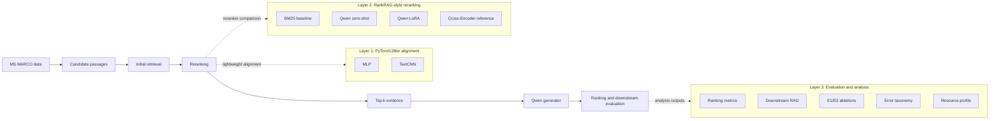

# RankRAG-Jittor

[English](README.md) | [简体中文](README.zh-CN.md)

A Jittor-based lightweight reproduction and empirical analysis of RankRAG-style LLM reranking.

## Overview

RankRAG-style systems first retrieve candidate passages, rerank them by relevance to the user query, and pass the best evidence to a generator. This repository studies that reranking chain on a controlled MS MARCO medium subset. It aligns lightweight PyTorch and Jittor rerankers, compares lexical, neural, LLM, LoRA, and Cross-Encoder rerankers, checks downstream RAG behavior, and analyzes ablations, error types, and resource records.

The goal is not to reproduce the full RankRAG paper. The project focuses on the empirical chain: judge passage relevance, rerank candidate passages, validate downstream answers, and inspect where errors and costs appear.

## Scope and Reproduction Boundary

| Included | Not included |
| --- | --- |
| PyTorch/Jittor MLP and TextCNN alignment baselines | Full reproduction of the original RankRAG paper |
| TF-IDF, BM25, Qwen zero-shot, Qwen LoRA, and Cross-Encoder reranking comparisons | Llama 3 8B/70B experiments from the original paper |
| Qwen2.5-1.5B LoRA reranker data-size and scoring-method ablations | Original-paper full data mixture and all benchmarks |
| Downstream RAG checks with Qwen2.5-1.5B and Qwen2.5-7B generators | Joint large-scale instruction tuning of ranking and generation |
| Error taxonomy over 30 stratified diagnostic cases | Claiming MLP/TextCNN as RankRAG core models |
| Resource and effectiveness profile from recorded artifacts | A strict hardware-normalized speed benchmark |

Cross-Encoder is used as an external pretrained effectiveness reference. MLP and TextCNN are lightweight alignment baselines, not original RankRAG core models.

## Project Pipeline



Mermaid source: [docs/figures/project_pipeline.mmd](docs/figures/project_pipeline.mmd)

## Main Results

The main reranking results use the same MS MARCO medium candidate pool: 500 queries and 4044 query-passage pairs. The LoRA row is the Stage E `10k-rerun`, not the historical 10k run.

| Method | R@1 | R@3 | R@5 | NDCG@5 | MRR | Pairwise Acc |
| --- | ---: | ---: | ---: | ---: | ---: | ---: |
| BM25 | 0.230 | 0.554 | 0.784 | 0.5074 | 0.4476 | 0.6253 |
| Jittor MLP | 0.228 | 0.506 | 0.712 | 0.4698 | 0.4318 | 0.5901 |
| Jittor TextCNN | 0.180 | 0.450 | 0.678 | 0.4270 | 0.3912 | 0.5484 |
| Qwen2.5-1.5B zero-shot | 0.236 | 0.552 | 0.812 | 0.5210 | 0.4525 | 0.6342 |
| Qwen2.5-1.5B LoRA 10k-rerun | 0.356 | 0.696 | 0.866 | 0.6236 | 0.5633 | 0.7343 |
| Cross-Encoder | 0.434 | 0.808 | 0.934 | 0.7019 | 0.6341 | 0.8049 |

Key observations:

- BM25 remains strong on this subset, which has clear lexical matching signals.
- From-scratch MLP/TextCNN models are useful for PyTorch/Jittor alignment, but they lack pretrained semantic ability.
- Qwen2.5-1.5B zero-shot has some semantic judgment ability, but the gain is limited.
- The 10k LoRA reranker improves R@1 from 0.236 to 0.356 over the same-size zero-shot Qwen reranker.
- Cross-Encoder is the strongest effectiveness reference here. LoRA's value is the RankRAG-style LLM reranking reproduction path, not beating every specialized reranker.

Full results: [docs/final_results.md](docs/final_results.md)

## PyTorch/Jittor Alignment

The repository includes PyTorch and Jittor implementations for MLP and TextCNN rerankers. Their purpose is to check framework migration and trend alignment on the same data split. The alignment experiments do not claim that Jittor always outperforms PyTorch, and they do not model the full RankRAG architecture.

Detailed table: [docs/final_results.md#2-pytorchjittor-alignment](docs/final_results.md#2-pytorchjittor-alignment)

## Ablation and Analysis

- LoRA data-size ablation: 1k / 3k / 10k-rerun nested training subsets with fixed 800 optimizer steps. See [docs/ablation_analysis.md](docs/ablation_analysis.md).
- LoRA scoring-method ablation: `generate_parse`, `relevant_logprob`, and `logprob_margin` on the same 10k-rerun adapter. See [docs/scoring_ablation_analysis.md](docs/scoring_ablation_analysis.md).
- Downstream RAG: BM25 / LoRA / Cross-Encoder evidence passed to Qwen generators under original and strict prompts. See [docs/downstream_rag_prompt_ablation_2x2.md](docs/downstream_rag_prompt_ablation_2x2.md).
- Error taxonomy: 30 stratified diagnostic queries and nine error types. See [docs/error_taxonomy.md](docs/error_taxonomy.md).
- Resource profile: effectiveness plus recorded training/runtime/memory metadata. See [docs/cost_effectiveness_analysis.md](docs/cost_effectiveness_analysis.md).

## Repository Structure

```text
configs/      Experiment and evaluation configs
data/         Small demo data and processed metadata
docs/         Reports, reproducibility guide, and figures
outputs/      Metrics, rankings, summaries, and generated tables
scripts/      Data, aggregation, validation, and orchestration scripts
src/          Core models, evaluators, aggregation, and RAG utilities
```

## Installation

The repository provides [requirements.txt](requirements.txt). There is no `environment.yml`, `pyproject.toml`, `setup.py`, `requirements-jittor.txt`, or `requirements-lora.txt`.

### PyTorch / analysis environment

```bash
python -m venv .venv
source .venv/bin/activate
pip install -r requirements.txt
```

On Windows PowerShell:

```powershell
python -m venv .venv
.\.venv\Scripts\Activate.ps1
pip install -r requirements.txt
```

### Jittor environment

The Jittor baselines were designed for CPU mode and are usually easier to run on Ubuntu or WSL than native Windows. See [docs/jittor_setup.md](docs/jittor_setup.md).

### LoRA / Qwen environment

Qwen zero-shot, LoRA training, LoRA evaluation, and downstream generation require local model weights outside this repository. Use environment variables such as `QWEN_LORA_MODEL_PATH` and `QWEN_GENERATOR_MODEL_PATH`; do not store model files in Git.

## Data Preparation

```bash
python scripts/prepare_data.py

python scripts/prepare_msmarco_subset.py \
  --max_train_queries 5000 \
  --max_valid_queries 500 \
  --max_test_queries 500 \
  --candidates_per_query 10 \
  --output_dir data/processed/msmarco_medium \
  --run_name msmarco_medium \
  --seed 42

python scripts/build_lora_data_size_ablation.py
python scripts/check_lora_data_ablation.py
```

## Reproduction Commands

### Quick Verification

These commands are CPU-only and do not train or run model inference:

```bash
python -m py_compile scripts/build_final_project_summary.py
python -m py_compile scripts/check_final_repository.py
python scripts/check_lora_data_ablation.py
python scripts/check_cost_effectiveness_outputs.py
python scripts/build_final_project_summary.py
python scripts/check_final_repository.py
```

### Full Reproduction

The full path includes data preparation, BM25/TF-IDF, PyTorch/Jittor MLP and TextCNN baselines, Qwen zero-shot reranking, Qwen LoRA training/evaluation, Cross-Encoder reference, downstream RAG, E1/E2 aggregation, Stage G error analysis, Stage F resource profile, and final summary generation.

The command list and environment notes are in [docs/reproduction.md](docs/reproduction.md).

## Key Output Files

| Path | Description |
| --- | --- |
| [outputs/final_results_summary.json](outputs/final_results_summary.json) | Machine-readable final summary |
| [docs/final_results.md](docs/final_results.md) | Final results tables |
| [outputs/cost_effectiveness_table.json](outputs/cost_effectiveness_table.json) | Resource-effectiveness table |
| [outputs/lora_ablation_results.json](outputs/lora_ablation_results.json) | E1 LoRA data-size ablation |
| [outputs/lora_scoring_ablation_results.json](outputs/lora_scoring_ablation_results.json) | E2 scoring-method ablation |
| [outputs/error_taxonomy_summary.json](outputs/error_taxonomy_summary.json) | Stage G error taxonomy summary |
| [docs/reproduction.md](docs/reproduction.md) | Reproduction commands |
| [docs/final_repository_audit.md](docs/final_repository_audit.md) | Final repository audit |

## Limitations

- This is a lightweight reproduction and empirical analysis, not a full RankRAG implementation.
- The main ranking benchmark uses a 500-query MS MARCO medium subset.
- Downstream RAG uses 50 questions.
- Error taxonomy uses 30 stratified diagnostic cases, not a full-distribution estimate.
- Resource records come from heterogeneous environments and are not a strict speed benchmark.
- Base model weights and LoRA adapters are not published in this Git repository.
- Better passage ranking increases the chance that correct evidence enters the context, but it does not guarantee the generator will use that evidence correctly.

## Citation and Acknowledgment

This project is inspired by the RankRAG idea of unifying context ranking with retrieval-augmented generation. The repository currently contains a verifiable title and venue-level reference, but no DOI or BibTeX metadata is added here unless it is independently confirmed.

```text
RankRAG: Unifying Context Ranking with Retrieval-Augmented Generation in LLMs.
NeurIPS 2024.
```

## License

No LICENSE file is currently present in this repository. No open-source license is claimed here.
