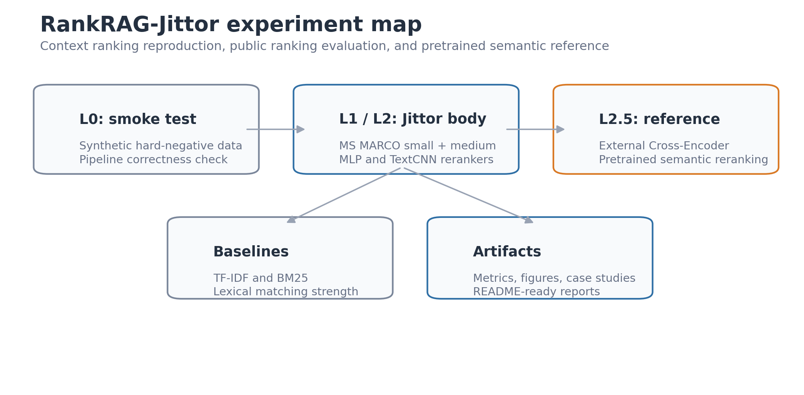
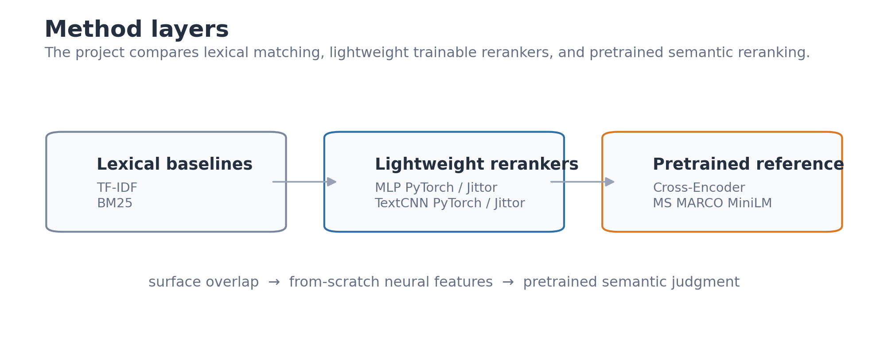
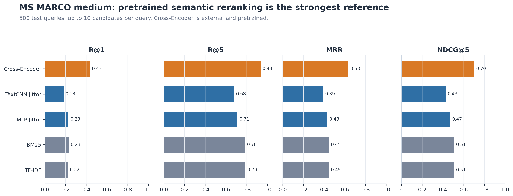
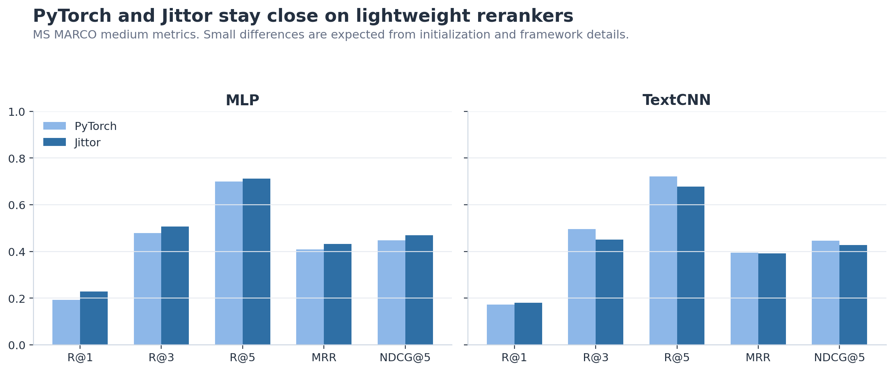
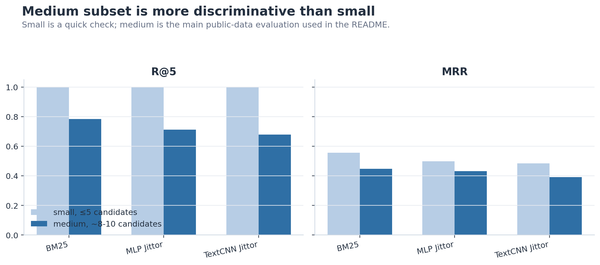
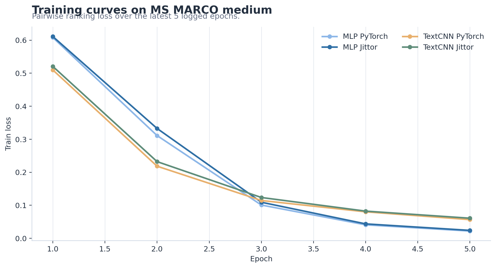

# RankRAG-Jittor

Resource-constrained reproduction and analysis of **RankRAG-style context ranking**: Jittor lightweight rerankers, MS MARCO small/medium evaluation, and an external pretrained Cross-Encoder reference for understanding why semantic reranking matters.



## Highlights

- Implements lightweight context rerankers in **Jittor** with PyTorch baselines.
- Evaluates on synthetic smoke tests plus **MS MARCO small and medium** subsets.
- Compares lexical baselines, trainable neural rerankers, and a pretrained semantic reranker.
- Provides PyTorch/Jittor alignment checks for both MLP and TextCNN.
- Adds a Cross-Encoder reference to explain the motivation behind RankRAG-style LLM reranking.
- Includes metrics, rankings, case studies, hardware notes, and reproducible README figures.

## What This Repository Covers



| Level | Role | Methods |
| --- | --- | --- |
| L0 | Pipeline validation | Synthetic hard-negative smoke test |
| L1 | Lightweight ranking reproduction | MLP PyTorch / Jittor |
| L2 | Public-data ranking comparison | TF-IDF, BM25, MLP, TextCNN |
| L2.5 | External semantic reference | Cross-Encoder MiniLM reranker |

The **Jittor reproduction body** is the MLP/TextCNN reranking implementation. The Cross-Encoder is an external pretrained reference, not a Jittor model.

## Main Result



| Method | Training | R@1 | R@5 | MRR | NDCG@5 |
| --- | --- | ---: | ---: | ---: | ---: |
| TF-IDF | none | 0.2220 | 0.7880 | 0.4465 | 0.5084 |
| BM25 | none | 0.2300 | 0.7840 | 0.4476 | 0.5074 |
| MLP Jittor | from scratch | 0.2280 | 0.7120 | 0.4318 | 0.4698 |
| TextCNN Jittor | from scratch | 0.1800 | 0.6780 | 0.3912 | 0.4270 |
| Cross-Encoder | external pretrained | 0.4340 | 0.9340 | 0.6341 | 0.7019 |

On the MS MARCO medium subset, the external pretrained Cross-Encoder is the strongest reranker. That does **not** make it the Jittor reproduction body; it is a semantic reference showing why RankRAG-style LLM reranking is valuable.

## Key Findings

1. **BM25 remains strong** on MS MARCO because lexical overlap is often informative.
2. **From-scratch lightweight rerankers are useful but limited**; they validate the Jittor ranking pipeline but lack pretrained semantics.
3. **PyTorch and Jittor are reasonably aligned** for MLP and TextCNN under the same subset setup.
4. **Pretrained semantic reranking is substantially stronger**, motivating the original RankRAG design choice.



## Why the Medium Subset Is the Main Public Experiment



The small subset is useful for quick debugging, but with at most five candidates per query, Recall@5 is naturally saturated. The medium subset uses 500 test queries and roughly 8-10 candidates per query, making R@5, MRR, and NDCG@5 more discriminative.

## Training Behavior



The lightweight rerankers train normally with pairwise ranking loss. These curves support the engineering reproduction claim, not full RankRAG performance.

## Reproduction Boundary

This project does **not** fully reproduce the complete Llama3-RankRAG pipeline.

It does not include:

- Llama3 instruction tuning
- answer generation
- full RankRAG unified ranking-generation training
- MS MARCO leaderboard-scale evaluation

It focuses on:

- context ranking / evidence selection
- lightweight Jittor reranker reproduction
- PyTorch/Jittor comparison
- semantic reranking analysis with an external pretrained Cross-Encoder

## Quick Start

Install dependencies:

```bash
conda create -p .venv-jittor python=3.10 -y
conda activate ./.venv-jittor
pip install -r requirements.txt
```

Synthetic smoke test:

```bash
python scripts/prepare_data.py
bash scripts/run_train_torch.sh
bash scripts/run_eval_torch.sh
bash scripts/run_train_jittor.sh
bash scripts/run_eval_jittor.sh
python src/compare_results.py
python src/plot_results.py
```

MS MARCO medium L2 workflow:

```bash
python scripts/prepare_msmarco_subset.py \
  --max_train_queries 5000 \
  --max_valid_queries 500 \
  --max_test_queries 500 \
  --candidates_per_query 10 \
  --output_dir data/processed/msmarco_medium \
  --run_name msmarco_medium \
  --seed 42

bash scripts/run_retrieval_baselines_msmarco_medium.sh
bash scripts/run_train_torch_msmarco_medium.sh
bash scripts/run_eval_torch_msmarco_medium.sh
bash scripts/run_train_jittor_msmarco_medium.sh
bash scripts/run_eval_jittor_msmarco_medium.sh
bash scripts/run_train_textcnn_torch_msmarco_medium.sh
bash scripts/run_eval_textcnn_torch_msmarco_medium.sh
bash scripts/run_train_textcnn_jittor_msmarco_medium.sh
bash scripts/run_eval_textcnn_jittor_msmarco_medium.sh
python src/aggregate_l2_results.py --run_name msmarco_medium
python src/case_study_msmarco.py --run_name msmarco_medium
```

External Cross-Encoder reference:

```bash
bash scripts/run_cross_encoder_msmarco_medium.sh
python src/aggregate_l25_results.py
python src/case_study_cross_encoder.py
```

Regenerate README figures:

```bash
python scripts/make_readme_figures.py
```

Readiness check:

```bash
python scripts/check_project_ready.py
```

## Documents

| Document | Purpose |
| --- | --- |
| [docs/method_summary.md](docs/method_summary.md) | Method scope and reproduction design |
| [docs/result_analysis.md](docs/result_analysis.md) | Full result interpretation |
| [docs/hardware_report.md](docs/hardware_report.md) | Hardware and environment report |
| [docs/msmarco_case_study.md](docs/msmarco_case_study.md) | Small-subset qualitative cases |
| [docs/msmarco_medium_case_study.md](docs/msmarco_medium_case_study.md) | Medium-subset qualitative cases |
| [docs/msmarco_medium_cross_encoder_case_study.md](docs/msmarco_medium_cross_encoder_case_study.md) | Cross-Encoder comparison cases |

## Key Artifacts

| Artifact | Path |
| --- | --- |
| L2 medium aggregate table | [outputs/l2_msmarco_medium_results.md](outputs/l2_msmarco_medium_results.md) |
| L2.5 aggregate table | [outputs/l25_msmarco_medium_results.md](outputs/l25_msmarco_medium_results.md) |
| Cross-Encoder metrics | [outputs/msmarco_medium_cross_encoder_metrics.json](outputs/msmarco_medium_cross_encoder_metrics.json) |
| Cross-Encoder rankings | [outputs/msmarco_medium_cross_encoder_rankings.json](outputs/msmarco_medium_cross_encoder_rankings.json) |
| README figures | [docs/figures](docs/figures) |

## Citation

```text
Yue Yu, Wei Ping, Zihan Liu, Boxin Wang, Jiaxuan You, Chao Zhang,
Mohammad Shoeybi, Bryan Catanzaro. 2024.
RankRAG: Unifying Context Ranking with Retrieval-Augmented Generation in LLMs.
NeurIPS 2024.
```

This repository uses MS MARCO subsets derived from `microsoft/ms_marco`. The Cross-Encoder reference uses `cross-encoder/ms-marco-MiniLM-L6-v2` from the sentence-transformers ecosystem.
