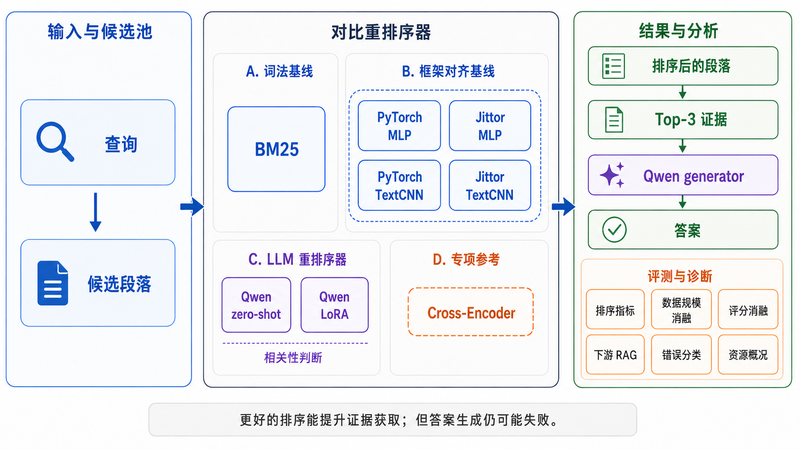
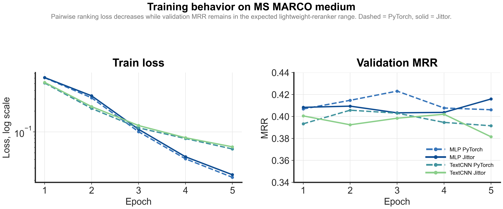

<div align="center">

# RankRAG-Jittor

**基于 Jittor 的 RankRAG 风格大模型重排序轻量复现**

复现 RankRAG 的核心重排序流程，并在统一的 MS MARCO 候选池上完成
PyTorch/Jittor 对齐、Qwen 大模型重排序、LoRA 微调和下游 RAG 验证。

[简体中文](README.md) · [English](README.en.md) · [完整实验结果](docs/final_results.md) · [详细复现说明](docs/reproduction.md)


[](https://arxiv.org/abs/2407.02485)



</div>

## 项目简介

RAG 系统会先检索一批与问题相关的资料，但关键词相似并不代表资料能够直接回答问题。本项目复现 RankRAG 的核心思路：在生成答案之前，重新判断问题与候选资料的相关程度，并把更有用的证据排到前面。

```text
Query
→ Candidate passages
→ Reranking
→ Top-k evidence
→ Answer generation
```

本项目选取 RankRAG（NeurIPS 2024）作为复现对象，重点完成了：

* PyTorch 与 Jittor 轻量排序器对齐；
* JittorLLM Qwen2.5-1.5B zero-shot 重排序；
* Qwen2.5-1.5B LoRA 重排序训练；
* BM25、轻量模型、大模型和 Cross-Encoder 对比；
* 数据量消融、评分方式消融和下游 RAG 验证。

---

## 为什么同时使用 Jittor、JittorLLM 和 PyTorch

RankRAG 的重点是使用大语言模型完成上下文排序与生成，而不是从零训练一个完整大模型。本项目没有把所有模块强行改写为 Jittor，而是按实验目的选择框架：能用 Jittor 对齐的轻量模型用 Jittor，对大模型 LoRA 微调则使用当前更成熟、可复现性更高的 PyTorch 生态。

考虑到原论文使用的模型和训练规模较大，本项目采用分层复现方案：

| 实验路径           | 框架                            | 作用                    |
| -------------- | ----------------------------- | --------------------- |
| MLP / TextCNN  | PyTorch + Jittor              | 验证轻量排序模型的框架迁移与结果对齐    |
| Qwen zero-shot | JittorLLM                     | 验证未经任务训练的大模型重排序能力     |
| Qwen LoRA      | PyTorch + Transformers + PEFT | 完成 RankRAG 风格的相关性任务微调 |
| Cross-Encoder  | PyTorch                       | 作为成熟的专用重排序效果参照        |

这样划分的原因如下：

* **为什么不全部做 PyTorch/Jittor 对齐**：MLP 和 TextCNN 参数规模小、训练稳定，适合做框架迁移和结果趋势对齐；Qwen2.5-1.5B LoRA 涉及 tokenizer、量化/半精度、LoRA adapter、显存管理和大模型训练生态，强行双框架对齐会把工作重点从 RankRAG 重排序复现转移到大模型训练框架移植。
* **为什么 Qwen LoRA 不使用 Jittor**：当前实验需要稳定复用 Transformers、PEFT、LoRA adapter 保存/加载和 log-prob scoring。PyTorch 生态在这些环节更成熟，能降低租卡训练失败风险，也便于复现实验结果。
* **为什么仍然保留 Jittor/JittorLLM**：Jittor 用于轻量排序器实现和 PyTorch 对齐，JittorLLM 用于 Qwen zero-shot 重排序验证，能够体现 Jittor 路径参与了核心排序流程，而不是只做外围脚本。

因此，本项目的合理性在于：用 Jittor 完成可控的框架复现与 zero-shot 大模型推理验证，用 PyTorch 完成成本更高、工程依赖更复杂的 LoRA 训练，并在同一候选池和指标下比较最终排序效果。

这种方案既保留了 Jittor 框架实现和 PyTorch 对齐要求，也覆盖 RankRAG 最关键的实验流程：

```text
相关性判断 → 候选资料重排序 → 下游问答验证
```

---

## 实验环境

| 实验部分           | 环境                                          |
| -------------- | ------------------------------------------- |
| 本地开发与结果整理      | Windows、Python 3.10、RTX 3060 Laptop GPU |
| PyTorch 轻量基线   | Windows 或 Linux、PyTorch，可在 CPU 上复现 |
| Jittor 轻量基线    | Ubuntu、Jittor，可在 CPU 上复现 |
| Qwen zero-shot | Linux、JittorLLM、GPU |
| LoRA 正式实验      | Ubuntu、RTX 4090 D、PyTorch、Transformers、PEFT |

LoRA 10k 正式实验记录如下，用于说明租用 GPU 环境中的实际资源消耗：

| 项目   |           数值 |
| ---- | -----------: |
| 训练步数 |          800 |
| 训练时间 |     187.90 秒 |
| 评估时间 |     444.29 秒 |
| 峰值显存 | 16,509.3 MiB |

完整环境说明见 [docs/reproduction.md](docs/reproduction.md)。

---

## 数据准备

项目使用统一的 **MS MARCO medium subset**。它是从 MS MARCO passage ranking 数据中抽取出的中等规模复现实验子集，用来在可控计算成本下验证重排序流程。构建时固定随机种子 `42`，从训练、验证和测试划分中生成本项目使用的 pairwise 训练数据、验证数据和测试候选池。

主评测候选池固定如下：

| 项目                  |    数量 |
| ------------------- | ----: |
| 测试问题                |   500 |
| Query-passage pairs | 4,044 |
| 每个问题候选数             | 最多 10 |
| 随机种子                |    42 |

也就是说，所有主要排序方法都在同一批 500 个测试问题和 4,044 个候选段落对上评测，避免因为候选池不同造成结果不可比。

构建 MS MARCO medium subset：

```bash
python scripts/prepare_msmarco_subset.py \
  --max_train_queries 5000 \
  --max_valid_queries 500 \
  --max_test_queries 500 \
  --candidates_per_query 10 \
  --output_dir data/processed/msmarco_medium \
  --run_name msmarco_medium \
  --seed 42
```

构建 LoRA 1k、3k、10k 嵌套训练集：

```bash
python scripts/build_lora_data_size_ablation.py
python scripts/check_lora_data_ablation.py
```

---

## Jittor 复现步骤

本节命令在 **Ubuntu + Jittor/JittorLLM** 环境中执行。MLP/TextCNN 可在 CPU 上复现；Qwen zero-shot 需要可用 GPU 和本地 Qwen2.5-1.5B 模型路径。

### 1. Jittor MLP

```bash
python src/train_jittor.py --config configs/msmarco_medium.yaml
python src/eval_jittor.py --config configs/msmarco_medium.yaml
```

### 2. Jittor TextCNN

```bash
python src/train_textcnn_jittor.py \
  --config configs/msmarco_medium_textcnn.yaml

python src/eval_textcnn_jittor.py \
  --config configs/msmarco_medium_textcnn.yaml
```

### 3. JittorLLM Qwen zero-shot 重排序

先在配置文件中填写本地 Qwen2.5-1.5B 模型路径：

```bash
python src/jittorllm_reranker/evaluate_qwen2_jittor.py \
  --config configs/jittorllm_qwen2_1_5b_full.yaml
```

---

## PyTorch 复现步骤

本节命令分为两类环境：PyTorch MLP/TextCNN 可在 Windows 或 Linux 的 CPU 环境中运行；Qwen LoRA 正式实验建议在 **Ubuntu + RTX 4090 D + PyTorch + Transformers + PEFT** 环境中运行，以避免本地 6GB 显存不足和训练时间过长的问题。

### 1. PyTorch MLP

```bash
python src/train_torch.py --config configs/msmarco_medium.yaml
python src/eval_torch.py --config configs/msmarco_medium.yaml
```

### 2. PyTorch TextCNN

```bash
python src/train_textcnn_torch.py \
  --config configs/msmarco_medium_textcnn.yaml

python src/eval_textcnn_torch.py \
  --config configs/msmarco_medium_textcnn.yaml
```

### 3. Qwen LoRA 重排序

在租用 GPU 环境中设置本地模型路径：

```bash
export QWEN_LORA_MODEL_PATH=/path/to/Qwen2.5-1.5B-Instruct
```

训练正式 10k 模型：

```bash
python src/lora_reranker/train_lora_reranker.py \
  --config configs/lora_qwen_1_5b_10k_lr1e4_s800_rerun.yaml
```

测试：

```bash
python src/lora_reranker/evaluate_lora_reranker.py \
  --config configs/lora_qwen_1_5b_10k_lr1e4_s800_rerun.yaml
```

1k、3k 和其他实验命令见 [完整复现说明](docs/reproduction.md)。

---

## 个人完成的主要工作

本项目为个人复现考核项目，核心实现、实验和分析由本人完成。除本地开发外，正式 LoRA 实验还使用租用 RTX 4090 D GPU 完成，训练过程中需要控制显存利用、避免覆盖历史结果、反复检查数据和配置一致性，以降低租卡时间成本。

1. 构建统一的 MS MARCO 训练、验证、测试数据和候选池；
2. 实现 PyTorch/Jittor MLP 与 TextCNN，并完成训练和测试对齐；
3. 使用 JittorLLM 完成 Qwen2.5-1.5B zero-shot 重排序；
4. 构建 LoRA 相关性训练数据并完成 1k、3k、10k 正式实验；
5. 实现 BM25、Cross-Encoder 和 Qwen LoRA 统一评测；
6. 完成数据量、评分方式和下游 RAG 消融实验；
7. 整理训练日志、性能日志、GPU 记录和结果可视化；
8. 编写数据检查、结果汇总和仓库完整性检查脚本。

其中成本最高的部分是 Qwen LoRA 训练和评估：需要在租卡环境中完成模型上传/路径配置、训练、评估、日志保存、结果下载和多轮一致性检查。最终 README 中保留的是正式结果和可复现命令，不把中间调试失败或本地不完整尝试包装成正式实验。

---

## PyTorch / Jittor 对齐


| 模型      | PyTorch R@1 | Jittor R@1 |
| ------- | ----------: | ---------: |
| MLP     |       0.192 |      0.228 |
| TextCNN |       0.172 |      0.180 |

MLP 和 TextCNN 用于满足 PyTorch/Jittor 对齐要求，并检查 Jittor 实现是否取得相近的整体趋势。它们不是 RankRAG 原论文的核心大模型排序器。

---

## 训练过程与 Loss 曲线



主要训练日志：

| 实验      | PyTorch 日志                                          | Jittor 日志                                            |
| ------- | --------------------------------------------------- | ---------------------------------------------------- |
| MLP     | [查看日志](logs/msmarco_medium_torch_train.log)         | [查看日志](logs/msmarco_medium_jittor_train.log)         |
| TextCNN | [查看日志](logs/msmarco_medium_textcnn_torch_train.log) | [查看日志](logs/msmarco_medium_textcnn_jittor_train.log) |

LoRA 正式训练日志：

* [1k 训练日志](logs/e1_autodl_4090d/1k_train.log)
* [3k 训练日志](logs/e1_autodl_4090d/3k_train.log)
* [10k 训练日志](logs/e1_autodl_4090d/10k_rerun_train.log)
* [10k 测试日志](logs/e1_autodl_4090d/10k_rerun_eval.log)

---

## 实验结果


| 方法             |       R@1 |       R@3 |       R@5 |     NDCG@5 |        MRR |
| -------------- | --------: | --------: | --------: | ---------: | ---------: |
| BM25           |     0.230 |     0.554 |     0.784 |     0.5074 |     0.4476 |
| Jittor MLP     |     0.228 |     0.506 |     0.712 |     0.4698 |     0.4318 |
| Jittor TextCNN |     0.180 |     0.450 |     0.678 |     0.4270 |     0.3912 |
| Qwen Zero-shot |     0.236 |     0.552 |     0.812 |     0.5210 |     0.4525 |
| Qwen LoRA 10k  |     0.356 |     0.696 |     0.866 |     0.6236 |     0.5633 |
| Cross-Encoder  | **0.434** | **0.808** | **0.934** | **0.7019** | **0.6341** |

主要结论：

* BM25 在当前数据上仍是较强的词面基线；
* Qwen LoRA 的 R@1 从 zero-shot 的 `0.236` 提升到 `0.356`；
* LoRA 微调能够明显改善大模型的相关性判断能力；
* Cross-Encoder 仍是当前实验中效果最强的专用排序参照。

完整指标和结果文件见 [docs/final_results.md](docs/final_results.md)。

---

## 补充实验


* [数据量消融](docs/ablation_analysis.md)：比较固定 800 steps 下的 1k、3k、10k 训练集；
* [评分方式消融](docs/scoring_ablation_analysis.md)：比较 `generate_parse`、`relevant_logprob` 和 `logprob_margin`；
* [下游 RAG](docs/downstream_rag_analysis.md)：验证排序提升能否转化为回答提升；
* [错误分析](docs/error_taxonomy.md)：分析词面误导、语义不足和证据使用失败；
* [资源分析](docs/cost_effectiveness_analysis.md)：整理时间、显存和硬件记录。

<details>
<summary>查看更多实验图</summary>


</details>

---

## 代码、脚本与日志索引

| 考核要求               | 仓库位置                                                |
| ------------------ | --------------------------------------------------- |
| Jittor 实现代码        | `src/train_jittor.py`、`src/train_textcnn_jittor.py` |
| PyTorch 对齐代码       | `src/train_torch.py`、`src/train_textcnn_torch.py`   |
| 数据准备脚本             | `scripts/prepare_msmarco_subset.py`                 |
| LoRA 数据脚本          | `scripts/build_lora_data_size_ablation.py`          |
| 训练脚本               | `src/lora_reranker/train_lora_reranker.py`          |
| 测试脚本               | `src/lora_reranker/evaluate_lora_reranker.py`       |
| 实验日志               | [`logs/`](logs/)                                    |
| 性能结果               | [`outputs/`](outputs/)                              |
| Loss 曲线            | `docs/figures/05_training_curves.png`               |
| PyTorch/Jittor 对齐图 | `docs/figures/pytorch_jittor_alignment.svg`         |
| 完整复现命令             | [`docs/reproduction.md`](docs/reproduction.md)      |

---

## 快速检查

下面的命令不会重新训练或推理，只会检查已有结果并生成汇总：

```bash
python scripts/build_final_project_summary.py
python scripts/build_readme_figures.py
python scripts/check_final_repository.py
```

---

## 复现范围

本项目复现的是 RankRAG 的核心实验路径：

```text
LLM relevance judgment
→ Passage reranking
→ Downstream RAG validation
```

受计算资源和考核周期限制，本项目没有复现原论文的 Llama 3 8B/70B、大规模联合训练和全部 benchmark。

MLP/TextCNN 是 PyTorch/Jittor 对齐基线；Qwen LoRA 是主要的大模型重排序实验；Cross-Encoder 是外部效果参照。

---

## 引用

* [RankRAG — arXiv](https://arxiv.org/abs/2407.02485)
* [RankRAG — OpenReview](https://openreview.net/forum?id=S1fc92uemC)

```bibtex
@inproceedings{yu2024rankrag,
  title = {RankRAG: Unifying Context Ranking with Retrieval-Augmented Generation in LLMs},
  author = {Yu, Yue and Ping, Wei and Liu, Zihan and Wang, Boxin and You, Jiaxuan and Zhang, Chao and Shoeybi, Mohammad and Catanzaro, Bryan},
  booktitle = {Advances in Neural Information Processing Systems},
  year = {2024}
}
```
