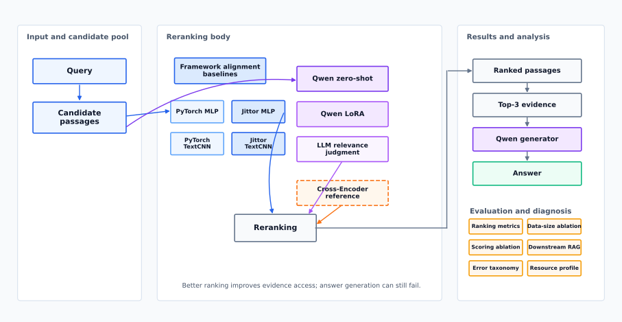
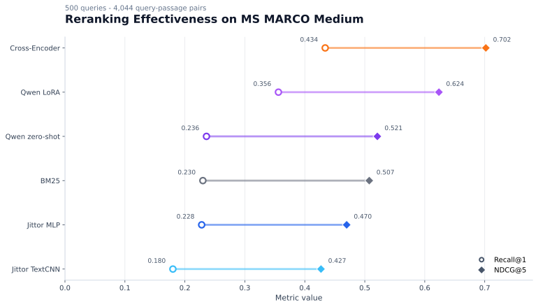
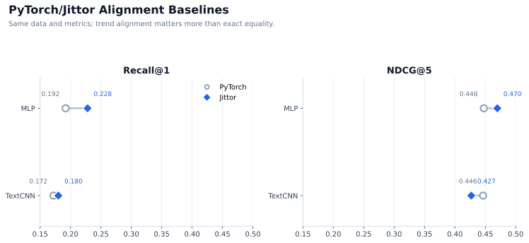
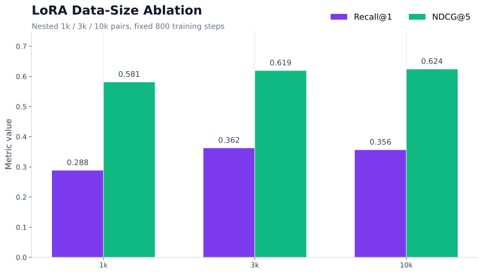
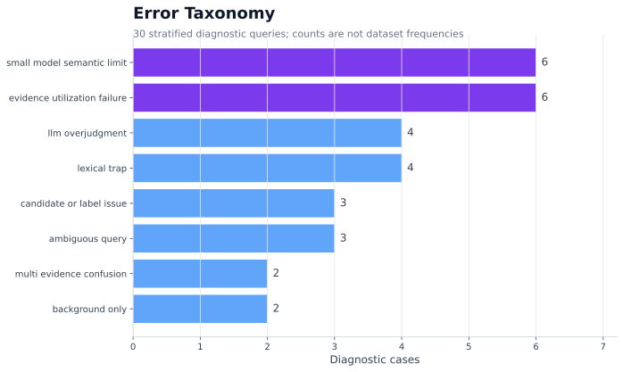
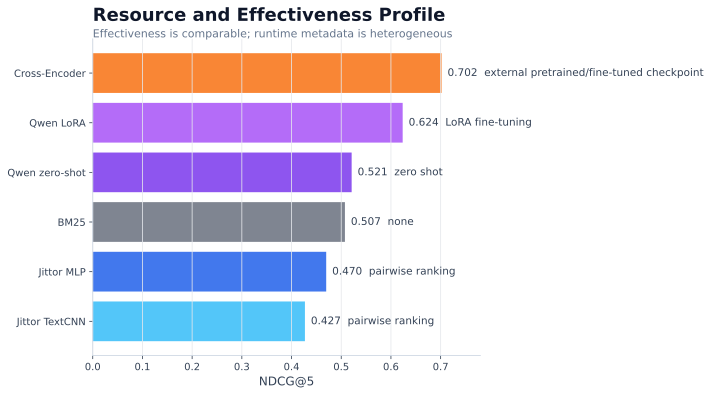

<div align="center">

# RankRAG-Jittor

**基于 Jittor 的 RankRAG 风格大模型重排序轻量复现与实证分析。**

[English](README.md) · [简体中文](README.zh-CN.md) · [结果总表](docs/final_results.md) · [复现说明](docs/reproduction.md)


[](https://arxiv.org/abs/2407.02485)



</div>

## 为什么做 RankRAG-Jittor？

本项目研究“在把资料交给大模型回答问题之前，怎样把真正有用的资料排到前面”。一个 RankRAG 风格流程通常是：先根据 Query 检索一批候选 passage，再用重排序模型判断 passage 和问题的相关性，把 top-k evidence 交给大模型生成答案，最后检查更好的排序是否真的带来更可靠的回答。

这个仓库围绕这条链路做轻量复现和实证分析：Jittor 轻量排序基线、Qwen2.5 大模型重排序、LoRA 任务适配、下游 RAG 验证、错误类型分析和资源画像。它不是 RankRAG 原论文的完整复现，而是聚焦“LLM relevance judgment -> rerank -> downstream validation”这条可复现实验路径。

## 一眼看清

| 项目 | 范围 |
| --- | --- |
| 评测集 | 500 个 query，4,044 个 query-passage pair |
| 主要方法 | BM25、Jittor MLP、Jittor TextCNN、Qwen zero-shot、Qwen LoRA、Cross-Encoder 参照 |
| 框架对齐 | PyTorch 与 Jittor 的 MLP/TextCNN 在同一数据和指标上对齐 |
| LLM 重排序 | Qwen2.5-1.5B zero-shot scoring 与 Qwen2.5-1.5B LoRA relevance scoring |
| 消融实验 | 1k / 3k / 10k LoRA 数据量消融，以及 scoring method 消融 |
| 诊断分析 | 50 题下游 RAG、30 个错误案例、资源—效果画像 |

## 主结果



| 方法 | R@1 | NDCG@5 | MRR |
| --- | ---: | ---: | ---: |
| BM25 | 0.230 | 0.5074 | 0.4476 |
| Jittor MLP | 0.228 | 0.4698 | 0.4318 |
| Jittor TextCNN | 0.180 | 0.4270 | 0.3912 |
| Qwen2.5-1.5B Zero-shot | 0.236 | 0.5210 | 0.4525 |
| Qwen2.5-1.5B LoRA (10k pairs) | 0.356 | 0.6236 | 0.5633 |
| Cross-Encoder Reference | 0.434 | 0.7019 | 0.6341 |

LoRA 行使用在统一的 RTX 4090 D 环境下完成的 10k LoRA 重跑结果。完整 R@3、R@5、pairwise accuracy、运行元数据和证据路径见 [docs/final_results.md](docs/final_results.md)。

三个核心判断：

- BM25 在这个子集上依然是很强的词面匹配基线。
- Qwen LoRA 明显优于 Qwen zero-shot，说明 RankRAG 风格的 LLM relevance judgment 经过任务适配后更有效。
- Cross-Encoder 是外部预训练效果参照，仍然是最强参考方法；LoRA 的价值是复现 LLM 重排序路径，而不是宣称超过专门的 Cross-Encoder。

## 复现了什么？

### PyTorch 到 Jittor 的对齐

MLP 和 TextCNN 是轻量对齐基线。它们用于确认两条实现路径的整体趋势一致、结果处于相近水平，不是 RankRAG 原论文的核心大模型重排序器，也不是为了超过 BM25。

### RankRAG 风格 LLM 重排序

LLM 轨道使用 Qwen2.5-1.5B 对 query-passage relevance 打分。项目先做 zero-shot reranking，再做 LoRA 微调，最后把得到的 passage 排序用于选择 top-k evidence。

### 端到端验证

仓库进一步检查排序提升是否能传递到下游答案生成，并分析数据量、打分方式、资源消耗和错误类型对结论的影响。

| 组件 | 运行框架 | 角色 |
| --- | --- | --- |
| MLP / TextCNN | PyTorch + Jittor | 框架对齐轻量基线 |
| Qwen zero-shot | JittorLLM | 无本地任务训练的语义重排序 |
| Qwen LoRA | PyTorch + Transformers + PEFT | RankRAG 风格 LLM 重排序目标 |
| Cross-Encoder | sentence-transformers / PyTorch | 外部预训练效果参照 |

## PyTorch/Jittor 对齐



这张图不是排行榜。它说明轻量 Jittor 实现与 PyTorch 对照在同一数据划分和指标定义下处于相近经验区间，服务于框架迁移可信度。

## 不止主指标



数据量消融比较嵌套的 1k、3k、10k LoRA training pairs，统一 800-step 预算。



错误分析区分 lexical trap、semantic limit、evidence utilization failure、label issue 和 ambiguous query。



资源画像记录效果、运行时间和硬件元数据，但不把异构硬件结果包装成严格速度 benchmark。

主结果表只压缩呈现最核心指标，详细分析回答不同问题：

- Scoring 消融区分模型本身和“怎样把 LLM 输出转成排序分数”这两个因素。
- 下游 RAG 检查 top-k evidence 变强后，生成答案是否真的变好。

## 关键发现

- 当 query 和 passage 有大量词面重合时，BM25 依然很有竞争力。
- 预训练语义能力重要：Qwen zero-shot 和 Cross-Encoder 都强于从零训练的轻量 Jittor 基线。
- 任务适配继续带来收益：Qwen LoRA 在同一候选池上显著优于 Qwen zero-shot。
- Cross-Encoder 仍是最强参照，这符合专门预训练重排序器的预期。
- 更好的排序只提高正确证据进入上下文的概率，生成模型仍可能没有用好证据。

## 快速检查

```bash
git clone https://github.com/healer-666/RankRAG-Jittor.git
cd RankRAG-Jittor
pip install -r requirements.txt
python scripts/build_final_project_summary.py
python scripts/build_readme_figures.py
python scripts/check_final_repository.py
```

上面命令只基于已有 artifact 重建汇总和 README 图，不会训练、推理、下载模型权重或重新生成 ranking。完整环境和可选实验命令见 [docs/reproduction.md](docs/reproduction.md)。

## 仓库结构

| 路径 | 用途 |
| --- | --- |
| `configs/` | 实验和评估配置 |
| `data/processed/` | 已处理 MS MARCO 子集与 LoRA pair 文件 |
| `src/` | 检索、重排序、评估和聚合代码 |
| `scripts/` | 复现检查、汇总、制图和分析脚本 |
| `outputs/` | 已提交的指标、ranking、汇总和分析图 |
| `logs/` | 历史运行日志与硬件监控记录 |
| `docs/` | 复现、结果、消融、错误和资源报告 |
| `docs/figures/` | README 与报告图 |

## 文档入口

| 文档 | 适合查看 |
| --- | --- |
| [docs/final_results.md](docs/final_results.md) | 完整指标表和结果证据路径 |
| [docs/reproduction.md](docs/reproduction.md) | 环境、数据准备与复现命令 |
| [docs/ablation_analysis.md](docs/ablation_analysis.md) | LoRA 数据量消融 |
| [docs/scoring_ablation_analysis.md](docs/scoring_ablation_analysis.md) | LoRA scoring method 消融 |
| [docs/downstream_rag_analysis.md](docs/downstream_rag_analysis.md) | 下游 RAG 评测 |
| [docs/error_taxonomy.md](docs/error_taxonomy.md) | 错误类型定义和诊断案例 |
| [docs/cost_effectiveness_analysis.md](docs/cost_effectiveness_analysis.md) | 资源—效果画像 |
| [docs/final_repository_audit.md](docs/final_repository_audit.md) | 最终仓库完整性审计 |

## 复现边界

本仓库是轻量复现和实证分析，不包含 Llama 3 实验、完整联合 RankRAG 训练、原论文全部 benchmark，也不把模型权重或 LoRA adapter 纳入 Git。主排序评测使用 MS MARCO medium subset：500 个 query、4,044 个 query-passage pair。Cross-Encoder 是外部预训练参照。资源记录来自不同环境，应理解为 provenance 和 profile，而不是严格速度 benchmark。

## 引用

RankRAG-Jittor 基于 RankRAG 论文：

- arXiv: [2407.02485](https://arxiv.org/abs/2407.02485)
- OpenReview: [RankRAG: Unifying Context Ranking with Retrieval-Augmented Generation in LLMs](https://openreview.net/forum?id=S1fc92uemC)

```bibtex
@inproceedings{yu2024rankrag,
  title = {RankRAG: Unifying Context Ranking with Retrieval-Augmented Generation in LLMs},
  author = {Yu, Yue and Ping, Wei and Liu, Zihan and Wang, Boxin and You, Jiaxuan and Zhang, Chao and Shoeybi, Mohammad and Catanzaro, Bryan},
  booktitle = {Advances in Neural Information Processing Systems},
  year = {2024}
}
```

## License

当前仓库未包含 LICENSE 文件。在正式 license 添加前，请按仓库所有者条款使用代码与 artifact。
