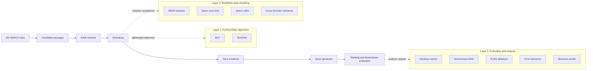

# RankRAG-Jittor

[English](README.md) | [简体中文](README.zh-CN.md)

基于 Jittor 的 RankRAG 风格大模型重排序轻量复现与实证分析。

## 项目简介

RankRAG 风格的系统会先为用户问题检索一批候选 passage，再判断这些 passage 和问题的相关性，重新排序后把靠前证据交给生成模型回答。本项目围绕这条链路做实证分析：候选资料、重排序、top-k 证据、Qwen 生成、排序与下游回答评估。

本项目不是完整复现 RankRAG 原论文，而是复现和分析“LLM 判断 passage relevance -> rerank -> downstream validation”这条思想链。项目同时包含 PyTorch/Jittor 轻量排序器对齐、Qwen zero-shot 与 LoRA 重排序、Cross-Encoder 效果参照、下游 RAG、消融实验、错误类型分析和资源画像。

## 复现范围和边界

| 已包含 | 未包含 |
| --- | --- |
| PyTorch/Jittor MLP 与 TextCNN 对齐基线 | 完整复现 RankRAG 原论文 |
| TF-IDF、BM25、Qwen zero-shot、Qwen LoRA、Cross-Encoder 重排序比较 | 原论文中的 Llama 3 8B/70B 实验 |
| Qwen2.5-1.5B LoRA 数据量和评分方法消融 | 原论文完整数据混合和全部 benchmark |
| Qwen2.5-1.5B / 7B 下游 RAG 检查 | 排序和生成的大规模联合指令微调 |
| 30 个分层诊断样例的错误类型分析 | 把 MLP/TextCNN 说成 RankRAG 原论文核心模型 |
| 基于已记录 artifact 的资源-效果画像 | 严格统一硬件的速度 benchmark |

Cross-Encoder 是外部预训练效果参照。MLP/TextCNN 是轻量对齐基线，不是 RankRAG 原论文核心模型。

## 项目流程



Mermaid 源文件：[docs/figures/project_pipeline.mmd](docs/figures/project_pipeline.mmd)

## 主结果

主排序结果使用同一个 MS MARCO medium candidate pool：500 个 query，4044 个 query-passage pair。LoRA 行使用阶段 E 的 `10k-rerun`，不是历史 10k 结果。

| Method | R@1 | R@3 | R@5 | NDCG@5 | MRR | Pairwise Acc |
| --- | ---: | ---: | ---: | ---: | ---: | ---: |
| BM25 | 0.230 | 0.554 | 0.784 | 0.5074 | 0.4476 | 0.6253 |
| Jittor MLP | 0.228 | 0.506 | 0.712 | 0.4698 | 0.4318 | 0.5901 |
| Jittor TextCNN | 0.180 | 0.450 | 0.678 | 0.4270 | 0.3912 | 0.5484 |
| Qwen2.5-1.5B zero-shot | 0.236 | 0.552 | 0.812 | 0.5210 | 0.4525 | 0.6342 |
| Qwen2.5-1.5B LoRA 10k-rerun | 0.356 | 0.696 | 0.866 | 0.6236 | 0.5633 | 0.7343 |
| Cross-Encoder | 0.434 | 0.808 | 0.934 | 0.7019 | 0.6341 | 0.8049 |

核心判断：

- BM25 在当前子集上仍然很强，说明数据里存在明显词面匹配信号。
- 从零训练的 MLP/TextCNN 很难超过 BM25，主要价值是 PyTorch/Jittor 对齐。
- Qwen2.5-1.5B zero-shot 已有一定语义判断能力，但提升有限。
- 10k LoRA 微调把 R@1 从 zero-shot 的 0.236 提升到 0.356。
- Cross-Encoder 仍是当前最强效果参照。LoRA 的意义在于 RankRAG 风格 LLM reranking 复现，而不是击败所有专用 reranker。

完整结果：[docs/final_results.md](docs/final_results.md)

## PyTorch/Jittor 对齐

项目包含 MLP 和 TextCNN 的 PyTorch/Jittor 实现。它们用于验证框架迁移和趋势对齐，不追求逐位相同，也不声称 Jittor 一定优于 PyTorch。

详细表格：[docs/final_results.md#2-pytorchjittor-alignment](docs/final_results.md#2-pytorchjittor-alignment)

## 消融和分析

- LoRA 数据量消融：1k / 3k / 10k-rerun 嵌套训练子集，固定 800 optimizer steps。见 [docs/ablation_analysis.md](docs/ablation_analysis.md)。
- LoRA 评分方法消融：同一个 10k-rerun adapter 上比较 `generate_parse`、`relevant_logprob`、`logprob_margin`。见 [docs/scoring_ablation_analysis.md](docs/scoring_ablation_analysis.md)。
- 下游 RAG：BM25 / LoRA / Cross-Encoder 证据输入 Qwen generator，并比较 original prompt 和 strict prompt。见 [docs/downstream_rag_prompt_ablation_2x2.md](docs/downstream_rag_prompt_ablation_2x2.md)。
- 错误类型分析：30 个分层诊断 query，九类错误。见 [docs/error_taxonomy.md](docs/error_taxonomy.md)。
- 资源-效果画像：整理效果、训练需求、runtime、显存和硬件记录。见 [docs/cost_effectiveness_analysis.md](docs/cost_effectiveness_analysis.md)。

## 仓库结构

```text
configs/      实验与评估配置
data/         小型 demo 数据和处理后的元数据
docs/         报告、复现指南和图
outputs/      指标、ranking、汇总和生成表格
scripts/      数据、聚合、检查和编排脚本
src/          模型、评估、聚合和 RAG 工具
```

## 环境安装

仓库提供 [requirements.txt](requirements.txt)。当前没有 `environment.yml`、`pyproject.toml`、`setup.py`、`requirements-jittor.txt` 或 `requirements-lora.txt`。

### PyTorch / 分析环境

```bash
python -m venv .venv
source .venv/bin/activate
pip install -r requirements.txt
```

Windows PowerShell：

```powershell
python -m venv .venv
.\.venv\Scripts\Activate.ps1
pip install -r requirements.txt
```

### Jittor 环境

Jittor 轻量基线按 CPU 模式设计，通常在 Ubuntu 或 WSL 上比原生 Windows 更稳定。见 [docs/jittor_setup.md](docs/jittor_setup.md)。

### LoRA / Qwen 环境

Qwen zero-shot、LoRA 训练/评估和下游生成都需要仓库外的本地模型权重。使用 `QWEN_LORA_MODEL_PATH` 和 `QWEN_GENERATOR_MODEL_PATH` 等环境变量，不要把模型文件放进 Git。

## 数据准备

```bash
python scripts/prepare_data.py

python scripts/prepare_msmarco_subset.py \
  --max_train_queries 5000 \
  --max_valid_queries 500 \
  --max_test_queries 500 \
  --candidates_per_query 10 \
  --output_dir data/processed/msmarco_medium \
  --run_name msmarco_medium \
  --seed 42

python scripts/build_lora_data_size_ablation.py
python scripts/check_lora_data_ablation.py
```

## 复现命令

### 快速检查

这些命令只做 CPU 检查，不训练模型，也不运行模型推理：

```bash
python -m py_compile scripts/build_final_project_summary.py
python -m py_compile scripts/check_final_repository.py
python scripts/check_lora_data_ablation.py
python scripts/check_cost_effectiveness_outputs.py
python scripts/build_final_project_summary.py
python scripts/check_final_repository.py
```

### 完整复现

完整流程包括数据准备、BM25/TF-IDF、PyTorch/Jittor MLP 和 TextCNN、Qwen zero-shot、Qwen LoRA 训练和评估、Cross-Encoder、下游 RAG、E1/E2 聚合、G 错误分析、F 资源画像和最终汇总。

详细命令和环境说明见 [docs/reproduction.md](docs/reproduction.md)。

## 主要输出

| Path | Description |
| --- | --- |
| [outputs/final_results_summary.json](outputs/final_results_summary.json) | 机器可读最终汇总 |
| [docs/final_results.md](docs/final_results.md) | 最终结果表 |
| [outputs/cost_effectiveness_table.json](outputs/cost_effectiveness_table.json) | 资源-效果表 |
| [outputs/lora_ablation_results.json](outputs/lora_ablation_results.json) | E1 LoRA 数据量消融 |
| [outputs/lora_scoring_ablation_results.json](outputs/lora_scoring_ablation_results.json) | E2 评分方法消融 |
| [outputs/error_taxonomy_summary.json](outputs/error_taxonomy_summary.json) | G 错误类型汇总 |
| [docs/reproduction.md](docs/reproduction.md) | 复现命令 |
| [docs/final_repository_audit.md](docs/final_repository_audit.md) | 最终仓库审计 |

## 局限性

- 这是轻量复现和实证分析，不是完整 RankRAG 实现。
- 主排序实验使用 500-query MS MARCO medium 子集。
- 下游 RAG 使用 50 个问题。
- 错误类型分析使用 30 个分层诊断样例，不代表 500 个 query 的总体比例。
- 资源记录来自不同环境，不能当成严格速度 benchmark。
- 基座模型权重和 LoRA adapter 不在 Git 中发布。
- 更好的 passage ranking 能提高正确证据进入上下文的概率，但不能保证 generator 一定正确使用证据。

## 引用和致谢

本项目受到 RankRAG 将上下文排序与检索增强生成结合这一思想启发。当前仓库只保留可核验的题名和会议级引用，不补写未确认 DOI、作者或 BibTeX 元数据。

```text
RankRAG: Unifying Context Ranking with Retrieval-Augmented Generation in LLMs.
NeurIPS 2024.
```

## 许可证状态

当前仓库没有 LICENSE 文件，因此这里不声明 MIT、Apache 或其他开源许可证。
